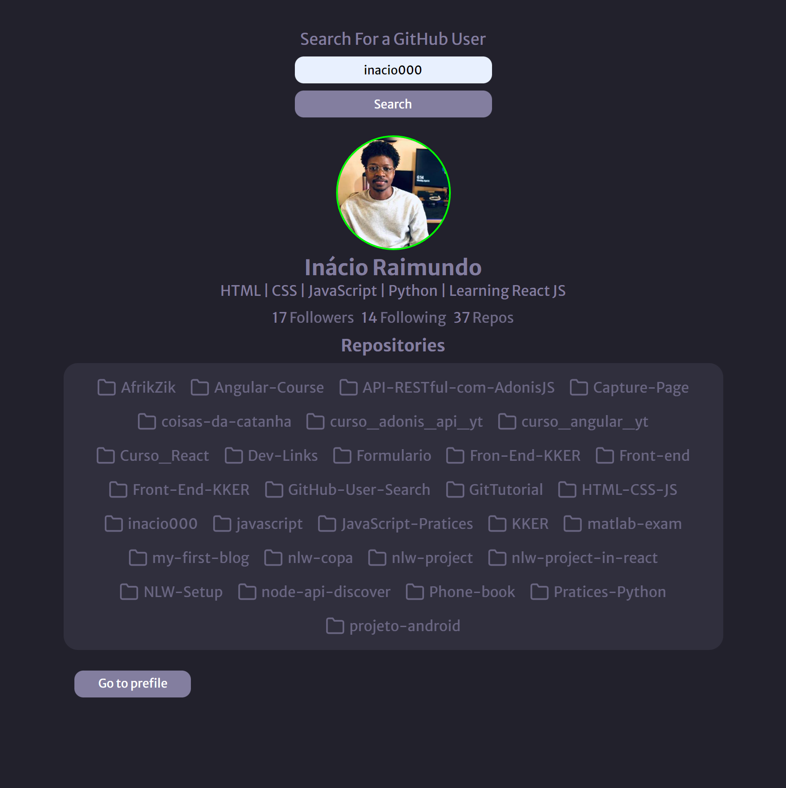

<h1 align="center">GitHub User Search</h1>
<h3 align="center"> using the GitHub API</h3>

  

# 🚀 Techs
> * HTML & CSS
> * JavaScript
> * Git & Github
> * Fetch Api

### [🔗Click here to view live](https://inacio000.github.io/GitHub-User-Search/)